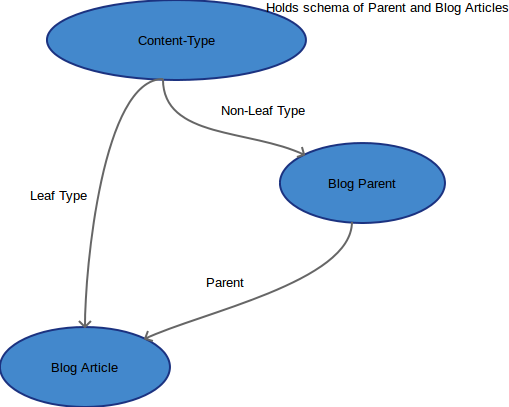

# Welcome to PirateLearner Blogging App

A Simple Blogging App that enables you to:

* Create/Decide Layout of the post.
* Arrange them in hierarchy.
* Write taggeble blog articles.

Apart from these stand-alone features this app can be used as Django-CMS apps also providing various plugins e.g.:

* Latest Entries Plugin (with Various view options).
* Section Views Plugin.
* Contact Page Plugin.
* Filter Entries based of Tags.

## Requirements

* [Python](https://www.python.org/) - 2.7.
* [Django](https://www.djangoproject.com/) - 1.5.x or 1.6.x.
* [Reversion](http://django-reversion.readthedocs.org/en/latest/) - 1.7.x or 1.8.x.
* [Taggit](https://django-taggit.readthedocs.org/en/latest/) - latest version.
* [Ckeditor](https://github.com/django-ckeditor/django-ckeditor)- 4.x.
* [Crispy Forms](http://django-crispy-forms.readthedocs.org/en/latest/) - latest version.
* [mptt](http://django-mptt.github.io/django-mptt/) - (0, 6, 1).
* [django_select2](https://github.com/applegrew/django-select2)

## Installation

Use pip for installing the app:

` pip install pi-blogging --pre`

__(Note that it is in beta version right now)__

or download zip file from github - [here](https://github.com/PirateLearner/pi.git)

after installation, add blogging to your installed apps and also make sure that requirements are also installed -

	INSTALLED_APPS = (
	...
	'reversion',
	'crispy_forms',
	'blogging',
	'taggit',
	'ckeditor',
	'django_select2',
	...
	)
	
Also add blogging urls in your projects urls.py -

	urlpatterns = i18n_patterns('',
	...
	url(r'^', include('blogging.urls',namespace='blogging')),
	...
	)

after this just run ` python manage.py syncdb ` for creation of database tables.

## Usage

Basic Usage of the Blogging App is creating blog entries and navigate among them. App has three core entities :

* Content Type.
* Blog Parent.
* Blog Entries.

These three entities have following relationship -

  

Content-Type can be of Leaf(for Parent) or Non-Leaf (Blog) type and is necessary for creating Parent or Blog entries. Once Content-Type  is created hierarchy can be
generated by creating various Parents. Blog entires must have one Content-Type (Non-Leaf) and one Parent.

Workflow for creating Blog entries comparises of three steps:- 

#### Create Content-Type

Content Type defines the Basic layout of the Article or it's Parent.
url for crating the Content-Type is ` {base_url}/content-type/ `. This url is first step for creation of Blog entries. Just click on the `+` hyperlink and new window
will pop-up where you can create the Conten-Type. 

__ please note that Name can not have space or special character as of now and Title fields is already include so do not add that in the fields area __

   
#### Create Blog Parent

As of now creation of Blog parent is not supported from front-end, so you have to create the content type using Admin site of Django.
Just click on the `Blog Parent` link and generate the hierarchy you want in your blogging. 

__ Make sure that a Non-Leaf Content-Type is selected in Content-Type while crating the Parent __

#### Create Blog Entries 

Blog entries can be created from the front-end. First step is selecting the content-type and url is ` {base_url}/content-type/ `, click on the next button and then you
will have the layout as were selected while creating Content-Type.      

 
